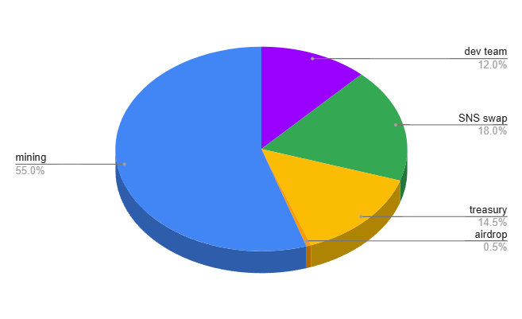

# Design

### Incentives

🌌 **Presence token**: Rewards users based on their engagement.

* **Daily minting**: A fixed amount of tokens is minted daily.
* **Distribution**: Two thirds go to the voters proportional to the amount of token locked. The rest is allocated to the vote creators, based on the popularity of their votes.

🔮 **Resonance token**: Rewards voters based on how accurate their vote aligns with the consensus at the time of unlock.

$$
resonance = amount * dissent[t_0]*consent[t]
$$

* Where:
  * `amount`: Bitcoins locked by the user.
  * `dissent_t_0`: opposite\_tokens / total\_tokens at the time of locking.
  * `consent_t`: same\_tokens / total\_tokens at the time of unlocking.

### Lock Duration

⏳ **Flexible lock duration**: The duration depends on the vote’s popularity _around_ the time the ballot is placed such that the more tokens locked, the longer the lock duration. Notice that this also applies for tokens that are locked after yours so the duration of your lock will increase if the popularity of the vote increases after your vote.

<figure><figcaption>
the lock duration depends on the popularity of the vote around the time you're voting
</figcaption></figure>

📈 **Time dilation curve**: A time dilation curve maps the amount of locked tokens to a specific duration, ensuring durations remain within a reasonable range (e.g., between one month and a few years) for locks ranging from 1 satoshi to thousands of Bitcoins.

See [https://www.desmos.com/calculator/luki2idinn](https://www.desmos.com/calculator/luki2idinn)
