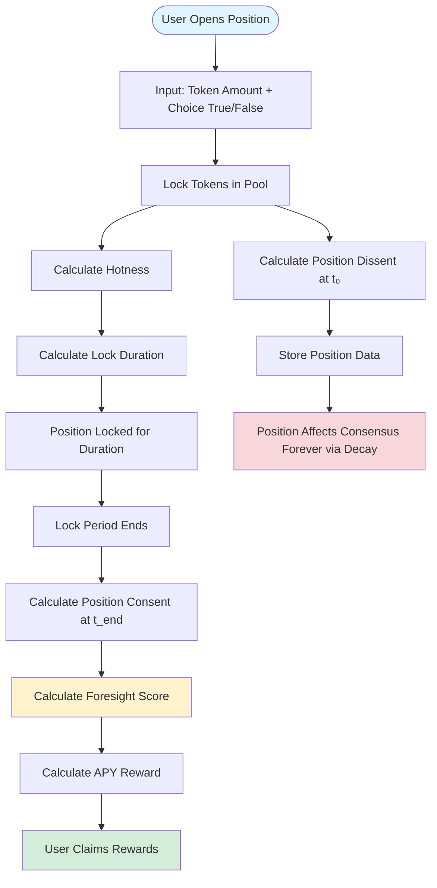
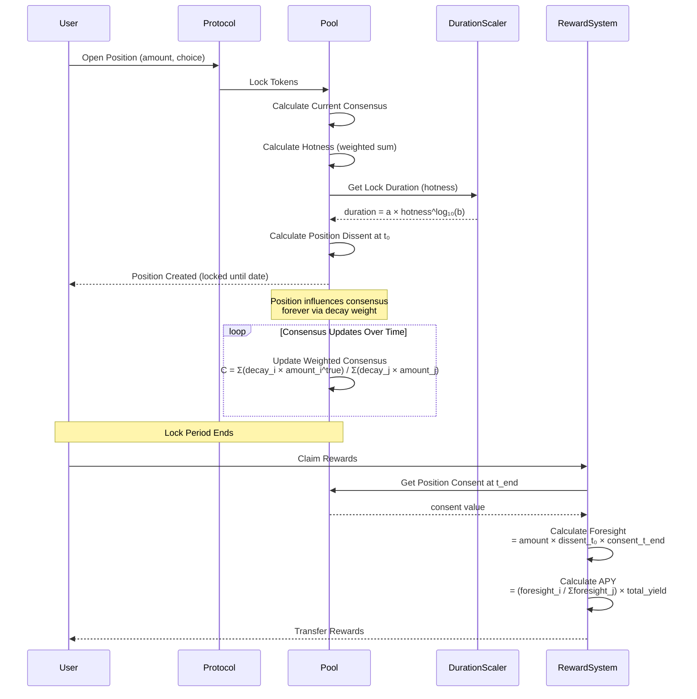
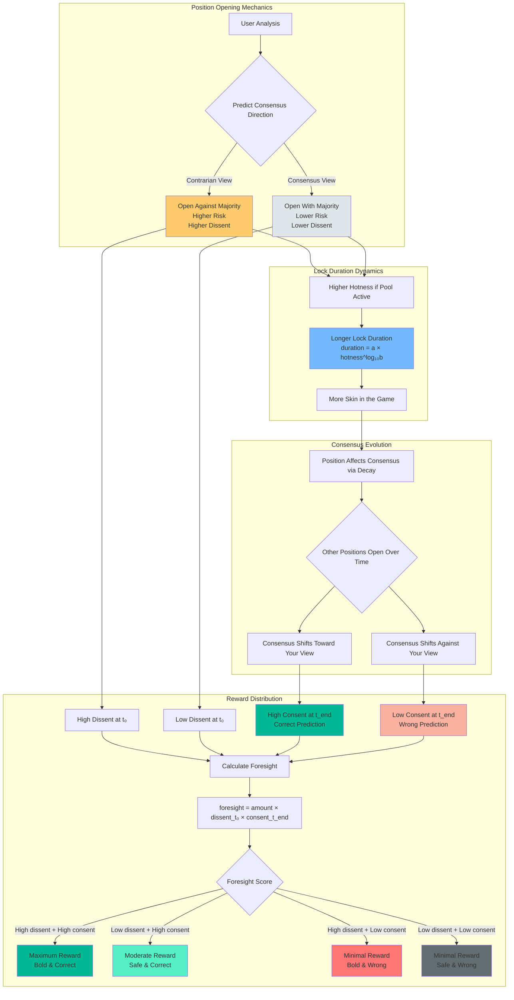

# Proof-of-Foresight

The Proof-of-Foresight defines the position rules and reward mechanisms, incentivizing participants to act sincerely and prioritize the establishment of lasting truth.

## System Overview

## Position Lifecycle Flow

## Economic Incentive Model

## Key Insights

**The Proof of Foresight rewards:**
1. **Boldness** - Taking contrarian positions against the current consensus (high dissent)
2. **Accuracy** - Being aligned with the final consensus when the lock period ends (high consent)
3. **Commitment** - Locking more tokens in popular pools creates longer lock durations, showing confidence

**Best case scenario:** Open a position against the majority (high dissent) that later becomes the consensus (high consent) = Maximum rewards

**Worst case scenario:** Open a position that ends up misaligned with the final consensus = Minimal/no rewards

This creates a natural incentive for participants to:
- Research and form genuine predictions
- Act early when they have conviction (higher dissent opportunities)
- Contribute to establishing lasting truth over time

