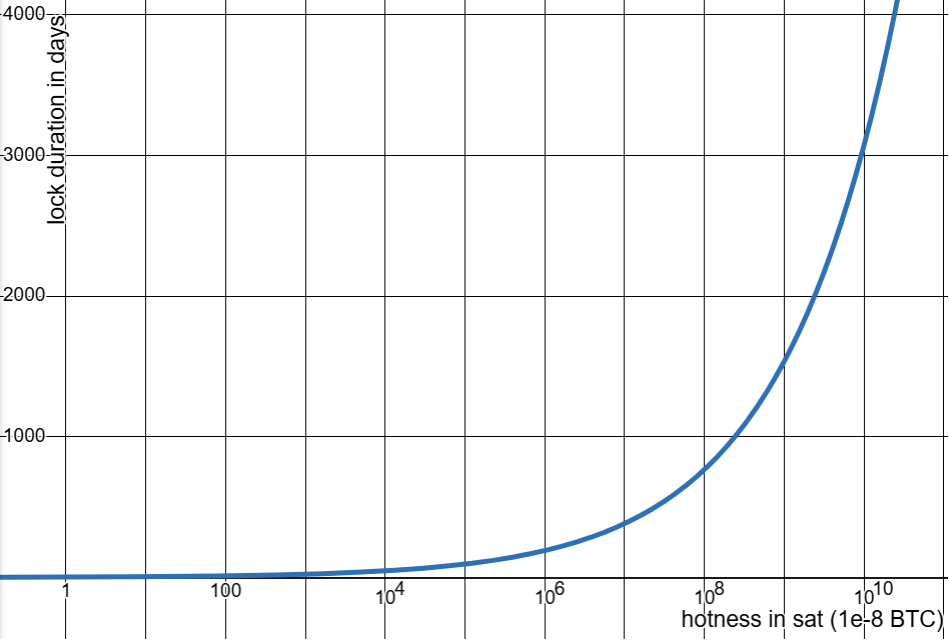

# Dynamic lock duration

The **lock duration** is determined by the **vote's popularity** at the time the **ballot** is cast, making each **lock duration independent**, even for ballots cast on the same vote.

<figure><figcaption>
The lock duration depends on the popularity of the vote at the time the ballot is cast and increases with subsequent ballots
</figcaption></figure>

The **hotness** of a ballot represents its **recent popularity** and determines how long ballots remain locked. It is calculated using the sum of a ballot’s own Bitcoin amount plus the weighted influence of surrounding ballots, adjusted by a **decay factor**:

$$
\text{hotness}_i = \text{amount}_i + \sum_{j < i} \left(\frac{\text{decay}_j}{\text{decay}_i} \times \text{amount}_j\right) + \sum_{j > i} \left(\frac{\text{decay}_i}{\text{decay}_j} \times \text{amount}_j\right)
$$

This formula ensures that **earlier ballots contribute to later ones**, while newer ballots also have a **retroactive impact** on older ones when popularity grows. As a result, lock durations extend naturally when votes gain traction over time.

To convert hotness into a lock duration, a **power scaling** function is applied. This function translates hotness into a **meaningful lock duration** while preventing extreme values (e.g., durations of just 10 seconds or over 100 years).&#x20;

<figure><figcaption>
Graph of the lock duration as a function of hotness. Here the nominal lock duration for 100 sats is set to 3 days. As hotness increases, the lock duration follows a power function, reaching 768 days (approximately 2 years) for a hotness of 1 BTC.
</figcaption></figure>

The function follows a power law, ensuring that the **duration doubles for each order of magnitude increase in hotness**:

$$
\text{duration} = \text{nominal\_lock\_duration} \times \text{hotness}^{\log(2)}
$$

where:

* $$nominal\_lock\_duration$$ is a protocol parameter representing the lock duration for the smallest possible ballot amount.
* $$log(2)$$ ensures that the duration doubles for each 10× increase in hotness.
