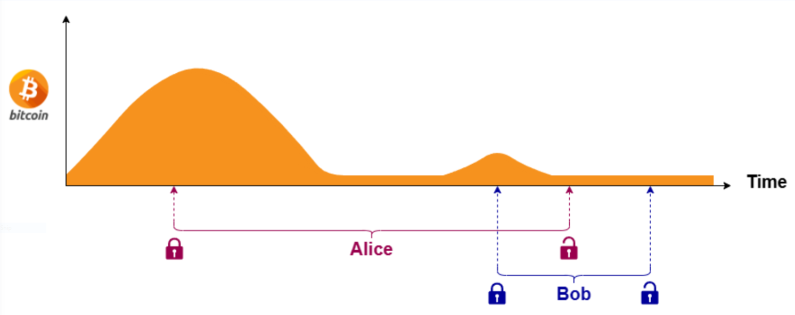

# Dynamic lock duration

The **lock duration** is determined by the **vote's popularity** at the time the **ballot** is cast, making each **lock duration independent**, even for ballots cast on the same vote. The **popularity** of a vote is measured by the **amount of Bitcoin recently locked** in it. If the vote's **popularity increases** after a ballot is placed, the **lock duration will adjust accordingly**, extending as a **post effect**.

<figure><figcaption>
The lock duration depends on the popularity of the vote at the time the ballot is cast and increases with subsequent ballots
</figcaption></figure>
