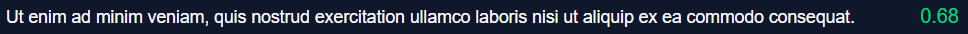

# Stake-weighted voting

At the heart of the Dsonance protocol is a **stake-weighted voting system** based on binary votes. Participants cast votes on statements to determine whether they are true or false. To vote, users select an outcome (_True_ or _False_), specify the amount of Bitcoin they wish to lock, and commit their stake. The more Bitcoin a user locks, the more their vote influences the outcome in the chosen direction.

<figure><figcaption>
Example of consensus expressed between 0 and 1
</figcaption></figure>

The current consensus is calculated by dividing the weighted sum of Bitcoins from the _True_ ballots by the weighted sum of Bitcoins from all ballots (_True_ and _False_). The weight of each ballot is determined by its decay over time, giving more recent ballots greater influence. This ensures that the consensus remains dynamic and can be contested more effectively over longer periods.

At the end of each lock duration, the original Bitcoin stake (except a small fee of 20 sats) is fully refunded to the voter. However, the consensus remains unchanged—unlocked Bitcoin is not removed from the vote result calculation.
