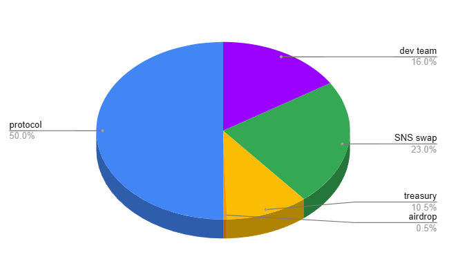

# Tokenomics

Dsonance operates with two tokens:

* **ckBTC** – A wrapped version of Bitcoin (BTC) on the Internet Computer (ICP).
* **DSN** – The native utility and governance token of the Dsonance platform.

### **ckBTC Token**

ckBTC is a tokenized version of Bitcoin on the Internet Computer, allowing fast and low-cost BTC transactions while maintaining full 1:1 backing through **chain-key cryptography**. Since it functions identically to BTC, the terms **ckBTC** and **BTC** are used interchangeably in this documentation, though the platform specifically operates with ckBTC.

BTC plays a central role in Dsonance:

* **Required to vote** – and shape consensus.
* **Incentive** – Generates BTC yield for voters whose past votes align with the current consensus.
* **Borrowing** – Can be borrowed against DSN tokens.

### **DSN Token**

The DSN token is the native utility and governance token of Dsonance, enabling governance through the DAO and serving key roles in the platform.

**Functions:**

* **Rewards** – 50% of the token is distributed to active participants.
* **Burn Mechanism** – Required for certain platform actions.
* **Collateral** – Used to borrow BTC.

The minting of DSN rewards follow an **exponential decay model** with a **4-year half-life**. Early users earn more, while emissions gradually decrease, ensuring long-term scarcity and sustainability

### **BTC Yield Mechanism**

Dsonance **generates BTC yield** by allowing users to **borrow BTC against their DSN holdings**. The borrowed BTC originates from ballot-locked funds, effectively turning **voting into a decentralized lending system**.

To ensure stability, the platform employs a **utilization-based interest rate model**, dynamically adjusting borrowing and lending rates based on supply and demand—similar to **Aave and Compound**.

Additionally, a **ckBTC/DSN liquidity pool** will be **bootstrapped using a portion of the ICP treasury from the SNS swap**, ensuring liquidity and price stability. This pool also enables the protocol to **sell DSN collateral when necessary**, protecting the system from insolvency.

### **Supply Dynamics & Deflationary Mechanisms**

The DSN token follows a **two-phase economic model**:

1. **Inflationary Phase** – Initially, DSN rewards will be abundant, and burn requirements will be minimal to encourage adoption.
2. **Deflationary Phase** – Over time, DSN rewards will decrease, while burning requirements will increase, leading to a progressively scarcer supply.

To reinforce this deflationary shift, **10% of all BTC yield generated** by the platform will be used to **buy back and burn DSN tokens**. This continuous reduction in supply helps drive long-term value appreciation and ensures the sustainability of the ecosystem.

#### **DSN Token Allocation**

<figure><figcaption></figcaption></figure>

The total supply of DSN will be **1 billion tokens**, distributed as follows to ensure long-term sustainability and alignment with ecosystem growth:

* **160 million DSN (16%) – Dev team**\
  Reserved as a **reward and incentive for the development team** for their contributions to the project.
* **230 million DSN (23%) – SNS Decentralization Swap**\
  Allocated for the SNS swap, ensuring broad community ownership and decentralized governance.
* **105 million DSN (10.5%) – Treasury**\
  Held in reserve for future initiatives, partnerships, ecosystem grants, and unforeseen needs.
* **5 million DSN (0.5%) – Airdrop**\
  A small portion dedicated to initial distribution, rewarding early adopters and fostering community engagement while minimizing the risk of excessive sell pressure.
* **500 million DSN (50%) – Protocol Rewards**\
  Gradually distributed to users over time as incentives for participating in the network, following an **exponential halving model every four years**, ensuring long-term engagement and sustainable growth.

