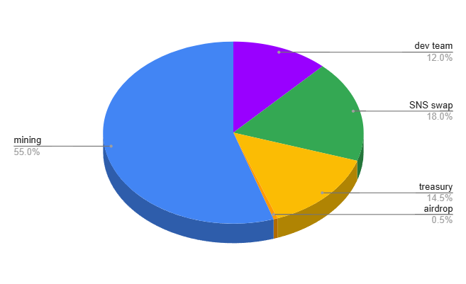

# Tokenomics

Dsonance operates with three tokens:

* **ckUSDT**: The supply token, used for voting and earning yield.
* **ckBTC**: The collateral token, used to secure the lending system.
* **DSN**: The native utility and governance token of Dsonance.

### **USDT Lending & Voting Mechanism**

Dsonance uses a lending utilization rate model similar to AAVE. 

Users supply ckUSDT to the platform, which is then locked in votes (ballots) to participate in consensus formation. The supply APY is redistributed to ballots, with the APY for each ballot dynamically maximized or minimized based on the proof-of-foresight mechanism. 

Users can borrow ckUSDT against their ckBTC collateral and repay their loans at any time. 

The platform remunerates itself using lending fees.

### **DSN Token**

The DSN token serves as a utility and governance token for the Dsonance platform:

* **Rewards** – Distributed to vote authors, voters, borrowers, and liquidity providers.
* **Burn Mechanism** – Required only to open new votes.
* **Governance** – Locked in neurons, enabling participation in decisions shaping the future of Dsonance.

The minting of DSN rewards follows an **exponential decay model** with a **4-year half-life**. Early users earn more, while emissions gradually decrease, ensuring long-term scarcity and sustainability.

### **Supply Dynamics & Deflationary Mechanisms**

The DSN token follows a **two-phase economic model**:

1. **Inflationary Phase** – Initially, DSN rewards will be abundant, and burn requirements will be minimal to encourage adoption.
2. **Deflationary Phase** – Over time, DSN rewards will decrease, while burning requirements will increase, leading to a progressively scarcer supply.

To reinforce this deflationary shift, platform lending fees will be used to buy back and burn DSN tokens. This ongoing reduction in supply supports long-term value appreciation and ecosystem sustainability.

#### **DSN Token Allocation**

<figure><figcaption></figcaption></figure>

The total supply of DSN will be **1 billion tokens** distributed as follows:

* **120 million DSN (12%) – Dev team**\
  Reserved as a **reward and incentive for the development team** for their contributions to the project.
* **180 million DSN (18%) – SNS Decentralization Swap**\
  Allocated for the SNS swap, ensuring broad community ownership and decentralized governance.
* **145 million DSN (14.5%) – Treasury**\
  Held in reserve for future initiatives, partnerships, ecosystem grants, and unforeseen needs.
* **5 million DSN (0.5%) – Airdrop**\
  A small portion dedicated to initial distribution, rewarding early adopters and fostering community engagement while minimizing the risk of excessive sell pressure.
* **550 million DSN (55%) – Mining**\
  Gradually distributed to users over time as incentives for opening votes and voting, following an **exponential halving model every four years**, ensuring long-term engagement and sustainable growth.

